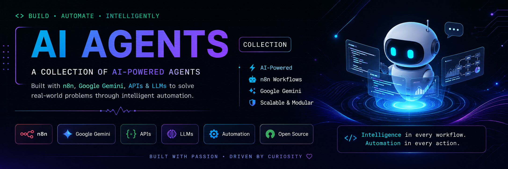

<p align="center">
  
</p>

<h1 align="center">🤖 AI Agents</h1>

<p align="center">
A curated collection of production-ready AI agents built with <b>n8n</b>, <b>Google Gemini</b>, <b>LLMs</b>, and modern automation workflows.
</p>

<p align="center">


</p>

---

## 🚀 Overview

This repository showcases a growing collection of **AI-powered agents** that automate real-world tasks using **Large Language Models**, **n8n workflows**, and external APIs.

Each agent is designed around a practical use case—from personalized learning assistants to voice-enabled shopping assistants—and demonstrates how autonomous AI systems can coordinate multiple tools to solve user problems efficiently.

The goal of this repository is to serve as a collection of reusable AI agents while exploring practical applications of modern LLMs, workflow automation, and intelligent tool orchestration.

---

## ✨ Featured Agents

| Agent | Description | Status |
|-------|-------------|:------:|
| 🧠 **Learning Path Generator** | Creates personalized learning roadmaps, researches resources, generates Google Docs, and schedules study plans in Google Calendar. | ✅ |
| 🎙️ **Transcription Summarizer** | Converts audio into text, generates structured summaries, and automatically stores them in Google Docs. | ✅ |
| 🛍️ **AI Shopping Assistant (Voice)** | Voice-enabled shopping assistant that searches products, provides fashion recommendations, and responds conversationally. | ✅ |
| 🛠️ **Multi-Tool Agent** | Intelligent assistant capable of web search, calculations, Wikipedia lookups, and productivity tasks through Telegram. | ✅ |

---

## 🏗 Repository Structure

```text
ai-agents
│
├── assets/
│   ├── banner.png
│   ├── architecture/
│   └── screenshots/
│
├── agents/
│   ├── Learning Path Generator/
│   ├── Transcription Summarizer/
│   ├── AI Shopping Assistant with Voice/
│   └── AI-Powered Multi-Tool Agent/
│
├── docs/
│
└── README.md
